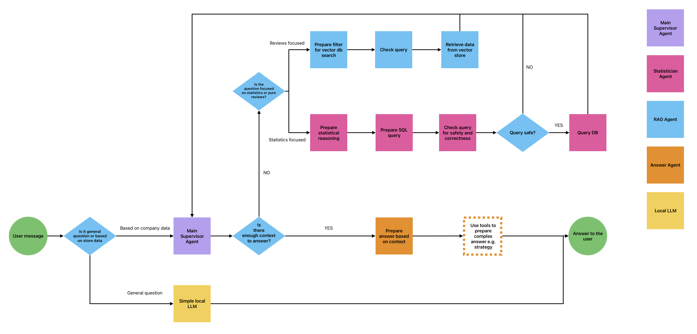

This repository is an example of a backend for agentic system built using LangChain. It is designed to generate insights from e-commerce data. As a knowledge source it uses a database with product reviews sourced from a Kaggle dataset.

The repository is organized into 3 main directories:
- notebooks: (EDA) and data transformations
- app: core application logic and functionality
- tests: testing scripts

The main.py file defines an API endpoint that can receive requests from a frontend application, as long as the requests follow this structure:

{
  "input": [
    { "role": "user", "content": "Question to the LLM" }
  ]
}

This universal format allows an easy integration with any frontend capable of sending such requests. By default, the backend expects frontend to manage conversation history for example stored in localStorage. But potentially can be replaced with a backend database that stores user IDs with their message history.

Currently, the app consits of: chat and agents, vector database, an SQL database, and scripts for setting up and populating these databases.

Key features of the application:
- Chat that allows user interaction
- Context-aware question answering based on the data (e-commerce reviews from Kaggle dataset)
- Agents that can query both SQL database and perform RAG on the vector database
- Main agent that delegates tasks to sub-agents and collects their responses
- Answer agent that combines the results and provides a final answer

### More workflow details:

The system can answer user messages with the context of recent interactions. User can ask the chatbot a general question, that is answered directly by a local LLM or if the question is context-dependent, it is redirected to the agentic system. Agentic system consists of several agents, all based on local LLMs. The main agent acts as a supervisor for the knowledge collection process: it supervises the collected context, both from the conversation memory and from responses provided by the sub-agents. Main agent decides whether more information is needed to answer user’s question, and if so, it determines whether to extract data using RAG or statistical analysis. It calls the suitable sub-agent.

The RAG agent can retrieve data from a constructed vector store that contains user reviews (fragmented into chunks) along with metadata from the dataframe. RAG agent determines whether a filter is needed for retrieval and applies the appropriate filter to search only the relevant data (for example, if the user asks about dresses, the vector store is first filtered by department = dresses, and the vector search is performed only on this subset) This solution was developed to improve the search accuracy of a small embedding model, as well as to optimize retrieval performance when handling large volumes of data in the database.

Statistical agent was developed to improve the system's math reasoning capabilities. The aim was to enable statistical analysis that relies on computation rather than language-based inference, because LLMs tend to make mistakes in the calculations. Because of that the agent first prepares a set of instruction (a hint for other LLM) that explains steps/components of SQL query. 
The prompt is designed to encourage the use of statistical functions and aggregations to extract meaningful insights, rather than returning unmodified tables. Second model prepares query based on the instructions. The query is checked for safety (for example any table modifications are not allowed), correct queries are executed and results are returned to the Main model.

The Last Answer agent is currently a simple LLM and a prompt that combines the obtained context into a final answer. Although this agent is very simple for now, implementing it as a separate class allows for future development, it could eventually use additional tools to not only generate a summary of the collected context but also perform actions adjusted to the user instructions and context. 

This project was created as a part of my programing portfolio, based on a Kaggle dataset containing E-Commerce Clothing Reviews: (https://www.kaggle.com/datasets/nicapotato/womens-ecommerce-clothing-reviews).